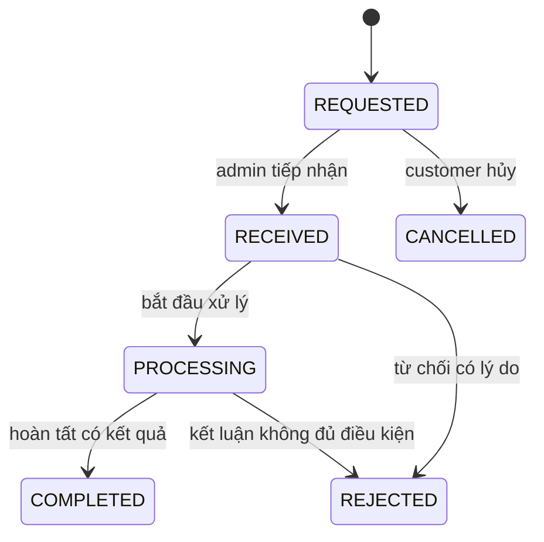

# PC Store — Đặc tả và kế hoạch triển khai

**Phiên bản:** 2.1

**Ngày cập nhật:** 26/09/2026

**Môn học:** Lập trình WWW Java

**Nhóm:** 16 — 5 thành viên

**Đề tài:** Website giới thiệu và bán máy PC trực tuyến

## 1. Mục đích và nguồn yêu cầu

Tài liệu này là nguồn thống nhất để phân tích, thiết kế, chia việc, hiện thực, kiểm thử, trình diễn và viết báo cáo. Phiên bản 2.0 thay thế phạm vi doanh nghiệp nhỏ của phiên bản 1.0 bằng một đồ án có thể hoàn thành bởi năm sinh viên trong một học kỳ.

Thứ tự ưu tiên khi có xung đột:

1. Yêu cầu đã đăng ký với giảng viên trong phiếu đề tài.
2. Quyết định phạm vi tại tài liệu này.
3. Đặc tả UI và cấu trúc repository.
4. Ý tưởng mở rộng và tài liệu tham khảo.

Nội dung trong phiếu đăng ký là yêu cầu đầu vào, không phải chỉ dẫn kỹ thuật bắt buộc. Các quyết định về kiến trúc, giao diện và công nghệ trong tài liệu này là lựa chọn của nhóm để hiện thực yêu cầu môn học.

## 2. Kết luận thu gọn phạm vi

PC Store tập trung vào một vòng nghiệp vụ duy nhất:

```text
Khách tìm PC
→ nhận tư vấn theo nhu cầu và ngân sách
→ thêm giỏ Session
→ đăng nhập/xác minh số điện thoại
→ đặt hàng COD hoặc VNPAY sandbox
→ Admin xác nhận và xử lý đơn
→ khách theo dõi kết quả
```

Tính năng nổi bật là **tư vấn chọn PC có giải thích**. Hệ thống bán PC hoàn chỉnh, không cho khách tự lắp từng linh kiện.

### 2.1. Phạm vi bắt buộc

- Guest xem danh sách, tìm kiếm, lọc và xem chi tiết PC.
- Guest sử dụng giỏ hàng lưu trong HTTP Session.
- Đăng ký/đăng nhập bằng email và mật khẩu, số điện thoại OTP hoặc Google.
- Email và số điện thoại của tài khoản là duy nhất.
- Customer phải có số điện thoại đã xác minh trước khi đặt hàng.
- Customer quản lý hồ sơ và một địa chỉ nhận hàng mặc định.
- Customer đặt hàng bằng COD hoặc VNPAY sandbox và xem lịch sử đơn.
- Customer xem hiệu lực bảo hành của mặt hàng đã giao, gửi và theo dõi yêu cầu bảo hành tối giản.
- Hệ thống gửi email/thông báo kết quả đăng ký và đặt hàng khi có email phù hợp.
- Admin tìm kiếm và quản lý sản phẩm, loại sản phẩm, tài khoản và đơn hàng.
- Admin không được xem mật khẩu.
- Admin chỉ xóa sản phẩm chưa có trong đơn, loại chưa có sản phẩm và tài khoản chưa từng đặt hàng.
- Admin được sửa số lượng mặt hàng trong đơn theo điều kiện nghiệp vụ an toàn.
- Dữ liệu nhập được kiểm tra tại client để hỗ trợ UX và luôn được kiểm tra lại tại server.
- Không dùng stored procedure, database function hoặc CHECK constraint để thay business validation trong Java. PK, FK, UNIQUE, NOT NULL và index vẫn được dùng để bảo vệ dữ liệu.

### 2.2. Tính năng nổi bật

Khách nhập nhu cầu chính, ngân sách tối đa, RAM tối thiểu và dung lượng lưu trữ tối thiểu. Hệ thống lọc PC đang bán, còn hàng và không vượt ngân sách; sau đó trả tối đa ba kết quả kèm lý do phù hợp, điểm hạn chế, giá, phần ngân sách còn lại và liên kết mua hàng.

Đây là rule engine xác định được kết quả, không phải AI. Hệ thống không tự suy FPS, benchmark hoặc cam kết hiệu năng từ tên CPU/GPU.

### 2.3. Ngoài phạm vi bản nộp

- Tự build PC từ linh kiện và kiểm tra tương thích.
- So sánh PC bằng màn hình riêng.
- Kho đa chi nhánh, phiếu nhập, ledger và serial từng máy.
- Checklist kỹ thuật, vận đơn, tích hợp hãng vận chuyển và hàng hoàn.
- Serial/hồ sơ từng máy, QR, vận chuyển bảo hành, quản lý linh kiện sửa chữa, chi phí, đổi máy và hoàn tiền.
- Đối soát COD, hoàn tiền tự động và màn hình tài chính riêng.
- Dashboard thống kê, audit UI, notification center và quản trị rule tư vấn.
- Khuyến mãi, voucher, tích điểm, đánh giá, trả góp và hóa đơn điện tử.
- Microservices, Kafka, Elasticsearch, Kubernetes và hệ thống quan sát chuyên biệt.

Các nội dung trên chỉ xuất hiện trong phần hướng phát triển của báo cáo. Chúng không phải backlog bắt buộc hoặc tiêu chí hoàn thành.

## 3. Người dùng và chức năng

### 3.1. Guest

- Xem trang chủ và danh sách PC.
- Tìm theo tên/SKU; lọc theo loại, hãng, khoảng giá, RAM và GPU.
- Sắp xếp theo mới nhất, giá tăng/giảm và tên.
- Xem ảnh, giá, cấu hình, bảo hành và tình trạng còn hàng.
- Nhận tư vấn chọn PC.
- Thêm, sửa số lượng, xóa và xem giỏ Session.
- Đăng ký và đăng nhập.

### 3.2. Customer

Có toàn bộ chức năng Guest và:

- cập nhật họ tên, email, điện thoại và địa chỉ mặc định;
- xác minh số điện thoại;
- xem bản tóm tắt checkout do server tính;
- đặt hàng COD hoặc VNPAY sandbox;
- xem danh sách và chi tiết đơn của chính mình;
- hủy đơn khi trạng thái cho phép;
- xem các mặt hàng còn/hết bảo hành, gửi yêu cầu và theo dõi tiến độ xử lý;
- đăng xuất.

### 3.3. Admin

- Sử dụng khu vực Customer theo yêu cầu đăng ký.
- Quản lý PC, loại sản phẩm và ảnh.
- Xem số lượng thực có, đang giữ và có thể bán của từng SKU.
- Điều chỉnh tồn có lý do và không được giảm dưới lượng đang giữ.
- Tìm kiếm, xem và cập nhật tài khoản trong phạm vi cho phép.
- Tìm kiếm, xem, xác nhận, sửa số lượng COD và cập nhật trạng thái đơn.
- Xem trạng thái/thông tin thanh toán ngay trong chi tiết đơn.
- Tiếp nhận, xử lý và đóng/từ chối yêu cầu bảo hành.

## 4. Quy tắc nghiệp vụ

### 4.1. Tài khoản và xác thực

- Email được trim, chuẩn hóa chữ thường và kiểm tra duy nhất.
- Số điện thoại được chuẩn hóa trước khi so sánh và kiểm tra duy nhất.
- Mật khẩu được hash bằng BCrypt; không log hoặc trả password hash.
- OTP gắn với mục đích, có hạn 5 phút, tối đa 5 lần thử và gửi lại sau tối thiểu 60 giây.
- Môi trường local/demo dùng OTP giả lập có nhãn rõ ràng; không chứa OTP cố định trong production profile.
- Google identity được định danh bằng issuer và subject.
- Google trả email đã tồn tại không tự gộp tài khoản; người dùng phải đăng nhập tài khoản hiện hữu để liên kết.
- Không được gỡ phương thức đăng nhập cuối cùng.
- Admin không thể tự cấp role qua form hồ sơ; không khóa/xóa Admin hoạt động cuối cùng.
- Khóa tài khoản phải chặn thao tác được bảo vệ ở lần request tiếp theo.

### 4.2. Catalog

- Mỗi cấu hình PC hoàn chỉnh là một SKU; SKU và slug là duy nhất.
- Trạng thái sản phẩm: `ACTIVE`, `INACTIVE`, `DISCONTINUED`.
- PC chỉ xuất hiện tại storefront khi `ACTIVE`.
- Thay đổi lớn về cấu hình phần cứng nên tạo SKU mới để không làm sai lịch sử.
- Order item lưu snapshot SKU, tên, cấu hình tóm tắt, giá và số tháng bảo hành.
- Sản phẩm đã có trong đơn không hard-delete; chuyển sang ngừng bán.
- Hãng được lưu là trường của PC; loại sản phẩm có bảng quản lý riêng.

Thông tin PC tối thiểu:

```text
sku, name, slug, category, brand
price, stockOnHand, reservedQuantity, status
cpu, gpu, ramGb, storageGb, storageType
motherboard, psu, caseName, operatingSystem
warrantyMonths, description, images
advisory profile scores/reasons/limitations
```

### 4.3. Giỏ hàng Session

- Giỏ không lưu trong PostgreSQL; mỗi dòng chứa product ID và số lượng.
- Thêm vào giỏ không giữ hàng.
- Số lượng là số nguyên dương; thao tác xóa dùng action riêng.
- Giá, trạng thái và tồn được đọc lại từ database khi xem giỏ và checkout.
- Sau login, Spring Security đổi session ID và giữ dữ liệu giỏ.
- Logout hủy Session, gồm cả giỏ, để an toàn trên máy dùng chung.
- Sau khi tạo đơn thành công, chỉ xóa các dòng/phiên bản giỏ đã dùng để đặt hàng.

### 4.4. Giá và checkout

```text
subtotal = Σ(unitPriceSnapshot × quantity)
grandTotal = subtotal + shippingFee
```

- Tiền dùng `BigDecimal` và `NUMERIC(19,0)`; tiền tệ VND.
- Server là nguồn sự thật của giá, phí và tổng tiền.
- Bản nộp dùng phí vận chuyển cố định 50.000 VND, cấu hình phía server và hiển thị trước khi xác nhận.
- Checkout yêu cầu user đăng nhập, giỏ không rỗng, điện thoại đã xác minh và địa chỉ hợp lệ.
- Tên người nhận có thể khác tên tài khoản; số điện thoại liên hệ lấy từ tài khoản đã xác minh.
- Order snapshot họ tên người nhận, số điện thoại và địa chỉ tại thời điểm đặt.
- Preview không giữ hàng và có hiệu lực 10 phút.
- Giá, phí hoặc phiên bản giỏ thay đổi thì yêu cầu preview/xác nhận lại.
- Submit dùng idempotency key; cùng key/cùng nội dung trả cùng kết quả, cùng key/khác nội dung trả conflict.
- Tạo order, order item, marker `orders.reservation_status=HELD`, tăng `products.reserved_quantity` và tạo payment attempt trong cùng transaction; không có bảng reservation riêng.

### 4.5. Tồn kho đơn giản theo SKU

```text
available = stockOnHand - reservedQuantity
```

- `stockOnHand` là số PC thực có theo SKU.
- `reservedQuantity` là số đang giữ cho đơn chưa xuất kho.
- Checkout khóa các dòng sản phẩm theo thứ tự ID cố định và kiểm tra `available >= requested`.
- Tạo đơn hợp lệ làm tăng `reservedQuantity`.
- Hủy hoặc hết hạn trước giao làm giảm `reservedQuantity`.
- Chuyển đơn sang `SHIPPING` làm giảm cả `stockOnHand` và `reservedQuantity`.
- Không được điều chỉnh `stockOnHand < reservedQuantity`.
- Sửa số lượng đơn phải cập nhật reservation trong cùng transaction.
- Không có phân hệ phiếu nhập, serial hoặc ledger. `inventory_adjustments` tối thiểu lưu SKU, chênh lệch, lý do, actor và thời gian để giải thích thao tác Admin.

### 4.6. Trạng thái đơn

```mermaid
stateDiagram-v2
    [*] --> AWAITING_PAYMENT: VNPAY
    [*] --> AWAITING_CONFIRMATION: COD
    AWAITING_PAYMENT --> AWAITING_CONFIRMATION: payment verified
    AWAITING_PAYMENT --> EXPIRED: 15 minutes
    AWAITING_PAYMENT --> CANCELLED: customer cancels
    AWAITING_CONFIRMATION --> CONFIRMED: admin confirms
    AWAITING_CONFIRMATION --> CANCELLED: COD PENDING only; customer or admin
    CONFIRMED --> SHIPPING: admin ships
    SHIPPING --> DELIVERED: admin confirms delivery
```



- Không cho chọn trạng thái bất kỳ từ dropdown; UI chỉ đưa action chuyển hợp lệ.
- Customer tự hủy VNPAY chưa trả hoặc COD đang chờ xác nhận.
- Đơn online đã trả tiền không tự hủy trong bản nộp; Admin xử lý ngoại lệ thủ công ngoài hệ thống.
- Admin chỉ sửa số lượng đơn COD, chưa thanh toán, đang `AWAITING_CONFIRMATION`.
- Sửa số lượng cần lý do; không cho đơn rỗng; giữ đơn giá/phí snapshot, tính lại tổng và cập nhật amount của COD attempt PENDING; chỉ tăng lượng PC còn ACTIVE.
- Mỗi thay đổi trạng thái và số lượng ghi lịch sử actor, thời gian, dữ liệu trước-sau và lý do.
- Order của Customer chỉ được đọc bởi chính Customer hoặc Admin.

### 4.7. Thanh toán

Trạng thái payment: `PENDING`, `PAID`, `FAILED`, `EXPIRED`, `CANCELLED`, `REVIEW_REQUIRED`.

**COD:** đơn được tạo ở `AWAITING_CONFIRMATION`; payment ở `PENDING`. Bản nộp coi COD hoàn tất khi đơn `DELIVERED`, không xây quy trình đối soát riêng.

**VNPAY sandbox:** mỗi attempt có merchant reference duy nhất. Return URL chỉ hiển thị trạng thái đọc từ server. IPN xác minh chữ ký, merchant, reference, response code, transaction status và số tiền trước khi cập nhật `PAID`. Callback trùng không được cập nhật lần hai. Callback sai không thay đổi trạng thái tài chính. Payment thành công sau khi order đã `EXPIRED` chuyển `REVIEW_REQUIRED`, giữ order hết hạn và cảnh báo Admin. Job hết hạn khóa order/payment trước khi chuyển trạng thái để tránh race với IPN.

### 4.8. Tư vấn PC

- Hồ sơ nhu cầu: `OFFICE_STUDY`, `PROGRAMMING`, `GAMING`, `CONTENT_CREATION`.
- Mỗi PC có score 1–5, lý do và hạn chế cho từng nhu cầu áp dụng.
- Lọc điều kiện bắt buộc trước, sau đó sort theo score giảm dần, giá tăng dần và SKU tăng dần.
- Chỉ trả PC `ACTIVE`, `available > 0`, không vượt ngân sách, đủ RAM và storage.
- Không có kết quả thì giải thích điều kiện nào đang giới hạn kết quả.
- Dữ liệu đánh giá do Admin nhập trong form PC; không có trang quản trị rule riêng.

### 4.9. Bảo hành tối giản

Phạm vi bảo hành dựa trên mặt hàng đã mua, không theo serial:

- Chỉ order `DELIVERED` mới bắt đầu bảo hành.
- `warrantyStartAt = deliveredAt`.
- `warrantyExpiresAt = deliveredAt + warrantyMonthsSnapshot`.
- Customer chỉ xem và gửi yêu cầu cho order item thuộc đơn của chính mình.
- Với order item có quantity lớn hơn 1, UI cho chọn vị trí máy `1..quantity`; hệ thống lưu `itemUnitIndex` để phân biệt tương đối mà không quản lý serial.
- Chỉ cho tạo yêu cầu khi còn hạn và không có yêu cầu đang mở cho cùng `orderItem + itemUnitIndex`.
- Customer nhập mô tả lỗi bắt buộc và tối đa ba ảnh minh họa; ảnh dùng cùng cơ chế media nội bộ với ảnh sản phẩm nhưng tách thư mục/quyền truy cập.
- Customer có thể hủy yêu cầu khi còn `REQUESTED`.
- Admin cập nhật theo đúng state machine; Customer chỉ thấy ghi chú công khai.



- `REJECTED` cần lý do công khai.
- `COMPLETED` cần kết quả xử lý công khai.
- Yêu cầu hết hạn bảo hành bị từ chối ngay khi tạo; Admin không dùng status để kéo dài thời hạn.
- Không tự phát sinh shipment, refund, replacement hoặc inventory adjustment từ yêu cầu bảo hành.
- Khi tạo yêu cầu hoặc đổi trạng thái, hệ thống gửi email nếu tài khoản có email; lỗi gửi mail không rollback thay đổi nghiệp vụ.

`warranty_requests` lưu tối thiểu request code, user ID, order item ID, unit index, thời hạn snapshot, mô tả lỗi, trạng thái, public resolution, internal note, version và timestamps. Ảnh tách sang `warranty_request_images`; timeline tách sang `warranty_request_events`.

## 5. Kiến trúc và công nghệ

### 5.1. Kiến trúc

Ứng dụng là modular monolith, một Spring Boot process và một PostgreSQL database.

```text
Browser
  ├── Thymeleaf HTML + Bootstrap + JavaScript
  └── JSON requests cho tương tác cần AJAX
              ↓
Spring MVC controllers / REST controllers
              ↓
Application services + domain rules
              ↓
JPA repositories / provider adapters
              ↓
PostgreSQL, Google OIDC, VNPAY sandbox, SMTP
```

MVC và REST controller gọi chung application service; không gọi HTTP nội bộ. Transaction boundary đặt ở application service. Không bắt buộc Spring Modulith; có thể dùng ArchUnit hoặc test package dependency khi cần.

### 5.2. Stack

| Thành phần | Công nghệ | Vai trò |
|---|---|---|
| Runtime | Java 21 | Ngôn ngữ backend LTS |
| Framework | Spring Boot 4.1.x | Application framework |
| Web/View | Spring MVC + Thymeleaf | Server-rendered UI và Web services |
| UI | Bootstrap 5.3 + CSS + JavaScript modules | Responsive và tương tác trình duyệt |
| Persistence | Spring Data JPA/Hibernate | ORM và repository |
| Database | PostgreSQL 18 | Dữ liệu quan hệ |
| Migration | Flyway | Version schema |
| Security | Spring Security + OAuth2 Client | Session, RBAC, CSRF, Google login |
| Validation | Jakarta Bean Validation | Validate form/request phía server |
| Payment | VNPAY sandbox adapter | Thanh toán online demo |
| Email | Spring Mail; Mailpit local | Email đăng ký/đơn hàng |
| API docs | springdoc OpenAPI | REST/Web service documentation |
| Test | JUnit, Mockito, MockMvc, Testcontainers, Playwright | Unit, integration và E2E |
| Build | Maven Wrapper | Build nhất quán |
| Local | Docker Compose | PostgreSQL và Mailpit |
| CI | GitHub Actions | Build/test trên pull request |

HTTP Session lưu trong memory của một instance. Redis và Spring Session là hướng mở rộng nếu triển khai nhiều instance.

### 5.3. Bảy module nghiệp vụ

| Module | Trách nhiệm |
|---|---|
| `identity` | Tài khoản, credential, external identity, OTP, profile, địa chỉ và quản lý user |
| `catalog` | PC, loại, ảnh, cấu hình, đánh giá tư vấn, số dư và giữ tồn |
| `cart` | Giỏ hàng trong HTTP Session |
| `advisory` | Nhận tiêu chí, lọc, xếp hạng và giải thích kết quả |
| `sales` | Checkout, order, revision, lịch sử trạng thái và email đơn |
| `payment` | COD, VNPAY attempt, callback và payment state |
| `aftersales` | Hiệu lực bảo hành theo order item, yêu cầu bảo hành và timeline xử lý |

Quy tắc module:

- Module sở hữu entity và repository của mình.
- Module khác chỉ gọi public application service hoặc contract trong `api`.
- `sales` điều phối checkout qua public service của catalog và payment.
- `aftersales` lấy order item đã giao và snapshot bảo hành qua public contract của `sales`, không truy cập order repository trực tiếp.
- Tích hợp ngoài đi qua port/adapter.
- Không tạo `common`, `utils` hoặc abstraction chưa có nhu cầu.

## 6. Mô hình dữ liệu

### 6.1. Nhóm bảng

| Module | Bảng chính |
|---|---|
| Identity | `users`, `user_roles`, `external_identities`, `verification_challenges` |
| Catalog | `categories`, `products`, `product_specs`, `product_images`, `product_suitability`, `inventory_adjustments` |
| Sales | `orders`, `order_items`, `order_revisions`, `order_status_history`, `idempotency_records` |
| Payment | `payment_attempts`, `payment_events` |
| Aftersales | `warranty_requests`, `warranty_request_images`, `warranty_request_events` |

`users` chứa email, password hash, phone, phone verified time, full name, địa chỉ mặc định, status và timestamps. `products` chứa `stock_on_hand`, `reserved_quantity` và `version` để bảo vệ cập nhật cạnh tranh.

### 6.2. Quy ước dữ liệu

- ID nội bộ dùng UUID; mã đơn hiển thị duy nhất và không thay cho authorization.
- Thời gian lưu UTC, hiển thị Asia/Ho_Chi_Minh.
- Email/phone/SKU/slug/reference dùng unique constraint phù hợp.
- Order và item dùng snapshot để lịch sử không đổi theo catalog/profile.
- Foreign key không cascade xóa lịch sử giao dịch.
- JSONB chỉ dùng cho callback đã loại secret hoặc snapshot khó chuẩn hóa; trường tìm kiếm thường xuyên dùng cột rõ ràng.
- Migration đã merge là bất biến; thay đổi dùng migration mới.
- Staging/demo dùng `spring.jpa.hibernate.ddl-auto=validate`.

## 7. Giao diện và contract

### 7.1. Danh mục 24 màn hình

| Nhóm | ID | Màn hình |
|---|---|---|
| Storefront | S01–S05 | Trang chủ; danh sách PC; chi tiết PC; tư vấn/kết quả; giỏ hàng |
| Xác thực | A01–A05 | Đăng nhập; đăng ký; OTP; quên mật khẩu; đặt lại mật khẩu |
| Customer | C01–C07 | Hồ sơ; checkout; kết quả; danh sách đơn; chi tiết đơn; bảo hành của tôi; chi tiết/tạo yêu cầu |
| Admin | M01–M07 | Danh sách PC; form PC; loại; danh sách đơn; chi tiết đơn; tài khoản; yêu cầu bảo hành |

Chi tiết field, route, state và responsive contract nằm trong `docs/ux/UI_SCREEN_SPEC.md`.

### 7.2. REST/Web service tối thiểu

```text
GET    /api/v1/products
GET    /api/v1/products/{slug}
POST   /api/v1/recommendations
GET    /api/v1/cart
POST   /api/v1/cart/items
PATCH  /api/v1/cart/items/{productId}
DELETE /api/v1/cart/items/{productId}
POST   /api/v1/checkout/preview
POST   /api/v1/orders
GET    /api/v1/me/orders
GET    /api/v1/me/orders/{orderCode}
POST   /api/v1/me/orders/{orderCode}/cancel
GET    /api/v1/me/warranties
GET    /api/v1/me/warranty-requests/{requestCode}
POST   /api/v1/me/warranty-requests
POST   /api/v1/me/warranty-requests/{requestCode}/cancel
POST   /api/v1/auth/otp/challenges
POST   /api/v1/auth/otp/verifications
GET    /api/v1/auth/me
GET    /integrations/vnpay/ipn
GET    /payments/vnpay/return
```

Admin ưu tiên MVC form vì giao diện Thymeleaf. Endpoint mutation dùng POST theo Post/Redirect/Get; REST dùng Problem Details.

### 7.3. Provider ports

```java
public interface OtpProvider {
    OtpSendResult send(OtpSendCommand command);
    OtpVerificationResult verify(OtpVerifyCommand command);
}

public interface PaymentGateway {
    PaymentInitiationResult initiate(PaymentInitiation command);
    VerifiedPaymentEvent verifyCallback(Map<String, String> parameters);
}

public interface MailSender {
    void send(MailMessage message);
}
```

Không tạo shipping, external warranty, replacement hoặc refund provider trong bản nộp.

## 8. Bảo mật và xử lý lỗi

- Session cookie `HttpOnly`, `Secure` khi HTTPS và `SameSite=Lax`.
- Giữ CSRF cho form và API dùng cookie; endpoint VNPAY được loại khỏi browser CSRF và bắt buộc verify chữ ký.
- Đổi session ID sau login để chống session fixation.
- Phân quyền ở route và application service; nút ẩn/disabled không thay authorization.
- Không bind entity trực tiếp từ form; dùng form/command riêng.
- HTML render bằng escaping mặc định của Thymeleaf.
- Upload ảnh chỉ nhận JPEG/PNG/WebP, tối đa 5 MB, kiểm tra MIME thực và đặt tên server-side.
- Ảnh yêu cầu bảo hành không đặt trong thư mục public; chỉ chủ yêu cầu và Admin được truy cập qua endpoint có authorization.
- Không log password, OTP, session ID, OAuth token, VNPAY secret hoặc callback nhạy cảm.
- REST trả Problem Detail kèm `errorCode`, `fieldErrors`, `traceId`; MVC hiển thị error summary và lỗi field.
- `409 Conflict` dùng cho duplicate, stale version, stock conflict và idempotency mismatch.
- Mọi list có pagination; query catalog/order tránh N+1.

## 9. Phân công nhóm

| Thành viên | Phạm vi chính | Đầu ra bắt buộc |
|---|---|---|
| Võ Văn Cảnh | Checkout, payment và tích hợp | COD/VNPAY, idempotency, callback, cấu hình nền tảng, test và UI kết quả |
| Bùi Ngọc Bửu | Catalog và tồn kho | Schema/migration, PC/category/image/spec, stock/reservation, Admin catalog và test |
| Huỳnh Đoàn Nhân | Storefront, cart và advisory | Thymeleaf storefront, Session cart, bộ tư vấn, responsive UI và test |
| Võ Văn Nhựt | Identity và quản lý tài khoản | Security, email/OTP/Google, profile, Admin user và security test |
| Lê Thị Kim Ngân | Quản lý/theo dõi đơn và chất lượng | Customer/Admin order UI, transition/history, E2E, traceability và báo cáo |

Ngân đồng thời chủ trì module `aftersales` tối giản: eligibility, request state machine, ba màn hình bảo hành và test tương ứng.

`sales` do Cảnh chủ trì contract checkout; Ngân sở hữu các use case quản lý và theo dõi order qua ticket rõ ràng. Mỗi người tự làm backend, UI, test và tài liệu của phạm vi mình.

Review chính: Bửu review Cảnh; Ngân review Bửu; Nhựt review Nhân; Cảnh review Nhựt; Nhân review Ngân.

## 10. Lộ trình 10 tuần

| Tuần | Mục tiêu | Kết quả kiểm tra được |
|---|---|---|
| 1 | Chốt v2, bootstrap Spring Boot/Maven, Compose, Flyway, CI | App khởi động; migration DB rỗng; CI xanh |
| 2 | ERD, security skeleton, design system và route skeleton | Login page, layout, schema v1 và contract được review |
| 3 | Email auth, OTP/Google, profile, Admin user | Ba phương thức đăng nhập và phân quyền chạy được |
| 4 | Catalog, category, ảnh, tìm/lọc và Admin catalog | Guest duyệt PC; Admin CRUD đúng ràng buộc |
| 5 | Session cart, stock/reservation và checkout preview | Cart và authoritative preview hoạt động |
| 6 | COD, order history, Admin order và email | Luồng COD xuyên suốt; sửa quantity đúng điều kiện |
| 7 | VNPAY sandbox; nền tảng bảo hành theo order item | Callback có test; eligibility và schema bảo hành hoàn thành |
| 8 | Tư vấn PC, UI bảo hành và responsive | Top 3 ổn định; request/timeline bảo hành chạy xuyên suốt |
| 9 | Integration/E2E, dữ liệu demo, security và concurrency | Mua hàng và bảo hành tối giản pass; không oversell |
| 10 | Regression, báo cáo, deployment và diễn tập | Release candidate, tài liệu và demo thống nhất |

Tuần 11–14 là dự phòng theo lịch môn học: sửa lỗi, hoàn thiện UX, cập nhật báo cáo và luyện bảo vệ. Không tự đưa chức năng đã cắt trở lại khi P0 chưa ổn định.

## 11. Kiểm thử và nghiệm thu

### 11.1. Unit và integration

- Email/phone trùng; OTP hết hạn, dùng lại và sai mục đích.
- Google email trùng không tự gộp.
- Product/category delete constraint.
- Cart quantity, sản phẩm inactive, giá và tồn thay đổi.
- Guest/thiếu phone/giỏ rỗng bị chặn checkout.
- Hai checkout tranh sản phẩm cuối không oversell.
- Submit lặp chỉ tạo một order.
- Sửa quantity COD cập nhật reservation và tổng tiền; online/paid bị chặn.
- Customer không đọc/hủy order của người khác.
- Callback VNPAY sai chữ ký/số tiền bị từ chối.
- Callback trùng chỉ xử lý một lần.
- IPN và expiry chạy đồng thời kết thúc ở trạng thái hợp lệ.
- Payment đến muộn chuyển `REVIEW_REQUIRED`, không hồi sinh order.
- Advisory không vượt budget/RAM/storage; bỏ hàng hết/ngừng bán; tie-break ổn định.
- Chỉ order đã giao mới có hiệu lực bảo hành; ngày hết hạn dùng snapshot.
- Customer không xem/tạo yêu cầu từ order item của người khác.
- Không tạo hai yêu cầu đang mở cho cùng item và unit index.
- Chuyển trạng thái bảo hành sai bị chặn; từ chối/hoàn tất thiếu lý do hoặc kết quả bị chặn.

Dùng PostgreSQL Testcontainers cho transaction/concurrency. Không dùng H2 để kết luận hành vi khóa.

### 11.2. E2E tối thiểu

1. Guest → tư vấn → chi tiết → giỏ.
2. Email login → xác minh phone → COD → xem đơn.
3. Google login → phone OTP → VNPAY sandbox → kết quả.
4. Admin tạo/sửa/ngừng bán PC và bị chặn xóa PC đã có đơn.
5. Admin sửa quantity COD, xác nhận, chuyển đang giao và đã giao.
6. Admin khóa user; user không tiếp tục thao tác được bảo vệ.
7. Customer xem bảo hành từ đơn đã giao, gửi yêu cầu; Admin tiếp nhận/xử lý; Customer xem timeline.

### 11.3. Dữ liệu demo

- 5 loại, 5–8 hãng dạng text và 20–30 PC.
- Bốn hồ sơ nhu cầu; mỗi PC có dữ liệu tư vấn cần thiết.
- Tồn đủ tạo tình huống còn hàng, hết hàng và tranh sản phẩm cuối.
- Ba Customer đại diện email, phone và Google.
- Đơn COD/VNPAY ở các trạng thái chính và một payment `REVIEW_REQUIRED`.
- Một đơn đã giao còn bảo hành, một item hết hạn và các yêu cầu ở `REQUESTED`, `PROCESSING`, `COMPLETED`.
- Toàn bộ dữ liệu cá nhân là giả; giá/cấu hình ghi rõ là fixture demo nếu chưa kiểm chứng.

## 12. Môi trường và bàn giao

Local bắt buộc:

```text
Spring Boot application
PostgreSQL
Mailpit
Local media directory
```

Profile:

- `local`: OTP giả lập, Mailpit, VNPAY sandbox tùy credential.
- `test`: Testcontainers và fake providers xác định được kết quả.
- `demo`: HTTPS, Google/VNPAY sandbox, SMTP cấu hình bằng environment.

Không commit `.env`, credential hoặc secret. README phải đủ để thành viên mới chạy database, migration và application.

### Definition of Done

Một feature hoàn thành khi đạt acceptance criteria; backend/UI hoạt động cùng nhau; validation và authorization đúng; migration/tài liệu được cập nhật; test phù hợp pass; không chứa secret; PR được review và CI pass; owner giải thích và demo được luồng của mình.

## 13. Kịch bản bảo vệ

1. Giới thiệu vấn đề chọn PC và phạm vi đồ án.
2. Guest nhập nhu cầu/ngân sách và xem gợi ý có giải thích.
3. Mở chi tiết, thêm giỏ và đăng nhập.
4. Chứng minh yêu cầu số điện thoại đã xác minh.
5. Checkout COD hoặc VNPAY; nêu server tính lại giá và giữ tồn.
6. Customer xem đơn.
7. Admin sửa quantity COD hợp lệ, xác nhận và cập nhật giao hàng.
8. Customer mở “Bảo hành của tôi”, gửi yêu cầu; Admin tiếp nhận và cập nhật; Customer xem timeline.
9. Thử xóa PC đã có đơn và nhận lỗi nghiệp vụ.
10. Trình bày test tranh sản phẩm cuối hoặc callback trùng, rồi mở CI và bảng truy vết.

Tiêu chí kết thúc: người ngoài nhóm có thể dựng ứng dụng theo README, thực hiện trọn luồng tư vấn và mua hàng bằng dữ liệu demo, còn từng thành viên giải thích được phần backend, dữ liệu, UI và kiểm thử mình phụ trách.

## Đồng bộ báo cáo lần 1 — v2.1

Báo cáo nhóm chức năng thành **12 use case chính**, không tách mỗi nút CRUD, OTP hoặc callback thành tính năng. Phạm vi vẫn **7 module, 24 màn hình, 20 bảng**; chưa code ứng dụng.

- [Đặc tả 12 chức năng](requirements/FUNCTIONAL_SPECIFICATION.md): bảng đặc tả, luồng con, activity và tiêu chí nghiệm thu.
- [Quy tắc nghiệp vụ](requirements/BUSINESS_RULES.md): BR01–BR15 và quyết định đồng bộ.
- [Thiết kế dữ liệu](data/DATABASE_DESIGN.md), [ma trận truy vết](requirements/TRACEABILITY_MATRIX.md), [báo cáo lần 1](reports/REPORT_01_ANALYSIS_AND_DESIGN.md).

Chốt chi tiết: S03 chỉ công bố ACTIVE; category không status; Admin user không có UI đổi role. Giá PC dương. Một order/một attempt, chỉ mở lại VNPAY PENDING cùng reference/deadline; FAILED cần hủy/đặt lại hoặc chờ hết hạn. Success đến sau hạn/hủy chuyển REVIEW_REQUIRED, không hồi sinh đơn. Bảo hành cộng tháng lịch tại Asia/Ho_Chi_Minh, có hiệu lực start≤now<end; yêu cầu đã gửi hợp lệ được xử lý sau end. District là trường địa chỉ tùy chọn. Reservation có HELD/RELEASED/CONSUMED để cập nhật tồn đúng một lần. User làm actor lịch sử không hard-delete.

Các quyết định trên bổ sung độ rõ cho v2.0, không mở rộng module/màn hình. Tài liệu thiết kế ghi rõ hiện trạng trước triển khai; không coi render diagram là nghiệm thu ứng dụng.
