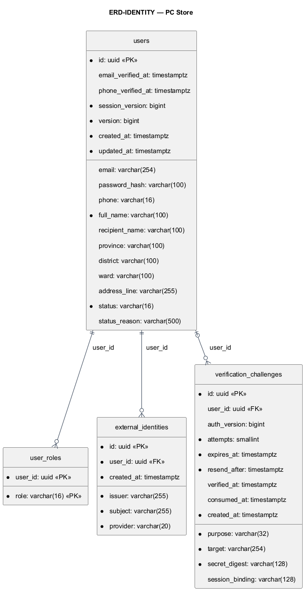
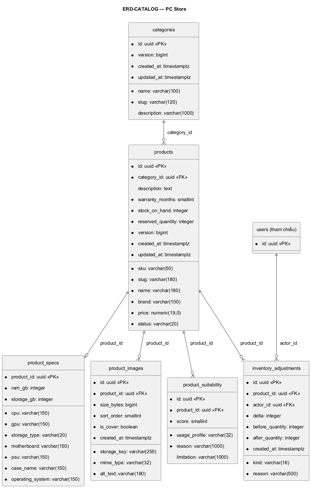
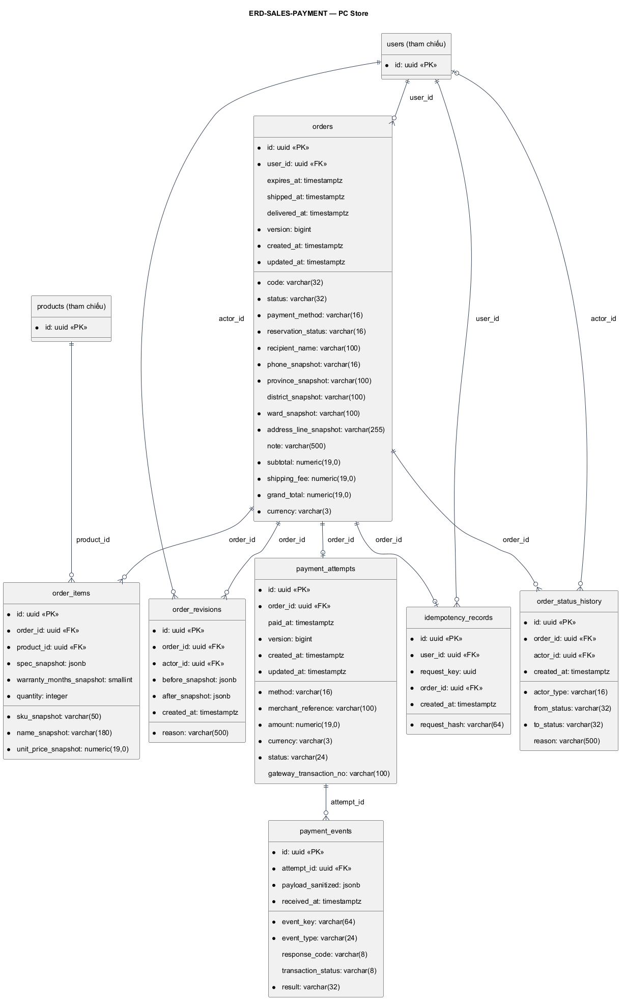
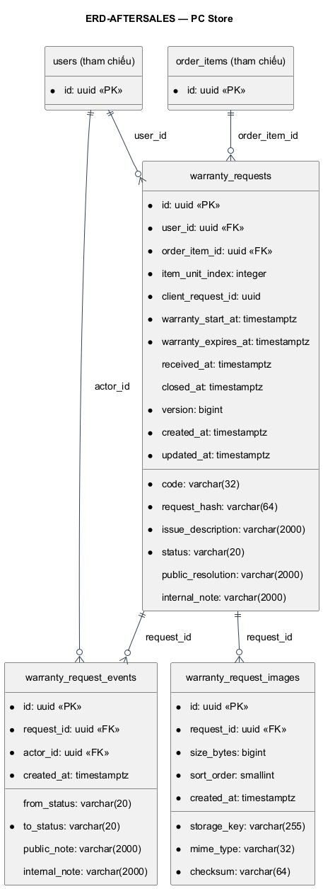

# PC Store — Thiết kế cơ sở dữ liệu

Phiên bản 2.1 — thiết kế trước hiện thực. **20 bảng**, không thêm bảng giỏ, reservation, shipment, serial hay refund. PostgreSQL; UUID do ứng dụng sinh; thời gian UTC với timestamptz; giá VND numeric(19,0). NN = NOT NULL, NULL = được bỏ trống. Giá trị mặc định trong bảng là contract ứng dụng/DDL dự kiến, chưa có migration.

## ERD tổng quát

[Nguồn sơ đồ ERD-ALL](../architecture/diagrams/report-01/source/ERD-ALL.puml)

Đường nối dùng crow’s foot: `||` đúng một, `o|` không hoặc một, `o{` không hoặc nhiều. Parent order có ít nhất một item và đúng một attempt sau commit, được bảo đảm bởi transaction ứng dụng; FK một chiều không tự chứng minh điều đó. Cột FK nullable có parent tùy chọn. `user_roles` dùng khóa ghép; `product_specs` dùng shared PK.

## Nguyên tắc quan hệ và lưu trữ

- FK mặc định RESTRICT/NO ACTION, không cascade xóa lịch sử. Xóa dữ liệu phụ của user/PC chưa phát sinh lịch sử bằng service theo thứ tự phụ→cha trong transaction.
- Application Java kiểm enum/range/state/owner; không dùng CHECK, trigger hoặc stored procedure để thay business validation theo yêu cầu đề tài.
- PK/FK/UNIQUE/NOT NULL và index bảo vệ quan hệ; partial unique cho một yêu cầu bảo hành mở và một ảnh cover.
- Không đặt index mọi cột. Index FK và tổ hợp truy vấn nêu tại từng bảng; đo lại khi có dữ liệu thực.
- orders + order_items + reservation_status xác định hàng đang giữ; products.reserved_quantity là số dư cập nhật cùng giao dịch. Cart/quote ở session.
- Snapshot sản phẩm/giá/địa chỉ/tháng bảo hành giữ lịch sử khi catalog/profile đổi. JSONB chỉ dùng snapshot có cấu trúc hoặc sự kiện đã lọc secret.

## ERD theo nhóm

### ERD-IDENTITY

[Nguồn sơ đồ ERD-IDENTITY](../architecture/diagrams/report-01/source/ERD-IDENTITY.puml)

### ERD-CATALOG

[Nguồn sơ đồ ERD-CATALOG](../architecture/diagrams/report-01/source/ERD-CATALOG.puml)

### ERD-SALES-PAYMENT

[Nguồn sơ đồ ERD-SALES-PAYMENT](../architecture/diagrams/report-01/source/ERD-SALES-PAYMENT.puml)

### ERD-AFTERSALES

[Nguồn sơ đồ ERD-AFTERSALES](../architecture/diagrams/report-01/source/ERD-AFTERSALES.puml)

## Từ điển dữ liệu đầy đủ

### 1. `users`

Module **identity** — Tài khoản và một địa chỉ mặc định.

| Cột | Kiểu | Khóa / null / mặc định | Ý nghĩa |
|---|---|---|---|
| id | uuid | PK, NN, app UUID | Định danh user |
| email | varchar(254) | NULL, UNIQUE | Email trim lowercase; null cho user phone-only |
| email_verified_at | timestamptz | NULL | Thời điểm email hiện tại được xác minh |
| password_hash | varchar(100) | NULL | BCrypt; null nếu chưa có local credential |
| phone | varchar(16) | NULL, UNIQUE | E.164 đã chuẩn hóa |
| phone_verified_at | timestamptz | NULL | Bằng chứng phone hiện tại đã xác minh |
| full_name | varchar(100) | NN | Tên hiển thị 2–100 ký tự |
| recipient_name | varchar(100) | NULL | Tên nhận mặc định |
| province | varchar(100) | NULL | Tỉnh/thành dạng text trong đồ án |
| district | varchar(100) | NULL | Trường tương thích địa chỉ, không bắt buộc |
| ward | varchar(100) | NULL | Phường/xã |
| address_line | varchar(255) | NULL | Địa chỉ chi tiết |
| status | varchar(16) | NN, ACTIVE | ACTIVE hoặc LOCKED |
| status_reason | varchar(500) | NULL | Lý do khóa/mở gần nhất |
| session_version | bigint | NN, 0 | Đổi khi cần vô hiệu mọi phiên cũ |
| version | bigint | NN, 0 | Optimistic lock |
| created_at | timestamptz | NN, app now | Ngày tạo UTC |
| updated_at | timestamptz | NN, app now | Ngày cập nhật UTC |

**Ràng buộc và index:** UNIQUE(email), UNIQUE(phone); index(status,created_at,id). Email/phone nullable nhưng Java bắt buộc còn ít nhất một phương thức đăng nhập dùng được; không hard-delete user có order hoặc actor history.

### 2. `user_roles`

Module **identity** — Vai trò cố định, không có màn hình phân quyền.

| Cột | Kiểu | Khóa / null / mặc định | Ý nghĩa |
|---|---|---|---|
| user_id | uuid | PK part, FK users.id, NN | User sở hữu |
| role | varchar(16) | PK part, NN | CUSTOMER hoặc ADMIN |

**Ràng buộc và index:** PRIMARY KEY(user_id,role). Admin có CUSTOMER và ADMIN; role chỉ seed/cấu hình quản trị ngoài UI bản nộp.

### 3. `external_identities`

Module **identity** — Liên kết OIDC Google.

| Cột | Kiểu | Khóa / null / mặc định | Ý nghĩa |
|---|---|---|---|
| id | uuid | PK, NN, app UUID | ID liên kết |
| user_id | uuid | FK users.id, NN | Tài khoản nội bộ |
| issuer | varchar(255) | NN | Issuer đã xác minh |
| subject | varchar(255) | NN | OIDC sub bất biến |
| provider | varchar(20) | NN, GOOGLE | Provider cho hiển thị |
| created_at | timestamptz | NN, app now | Ngày liên kết |

**Ràng buộc và index:** UNIQUE(issuer,subject); UNIQUE(user_id,provider). Không lưu access/refresh token để đăng nhập đơn thuần.

### 4. `verification_challenges`

Module **identity** — OTP, xác minh email và reset password dùng chung cấu trúc, phân tách purpose.

| Cột | Kiểu | Khóa / null / mặc định | Ý nghĩa |
|---|---|---|---|
| id | uuid | PK, NN, app UUID | Challenge opaque |
| user_id | uuid | FK users.id, NULL | Null cho phone login chưa biết user |
| purpose | varchar(32) | NN | PHONE_LOGIN, PHONE_CHANGE, EMAIL_CHANGE, RESET_PASSWORD |
| target | varchar(254) | NN | Email/phone chuẩn hóa cần xác minh |
| secret_digest | varchar(128) | NN | Token hash; OTP dùng keyed digest, không lưu plaintext |
| session_binding | varchar(128) | NULL | Hash ràng buộc session cho OTP/link; reset email không yêu cầu cùng browser |
| auth_version | bigint | NULL | sessionVersion khi phát hành challenge cho user |
| attempts | smallint | NN, 0 | Số lần OTP sai |
| expires_at | timestamptz | NN | Hạn theo purpose |
| resend_after | timestamptz | NN | Cooldown gửi lại |
| verified_at | timestamptz | NULL | Đã chứng minh mã nhưng chưa hoàn thành nghiệp vụ |
| consumed_at | timestamptz | NULL | Đã dùng hoặc vô hiệu |
| created_at | timestamptz | NN, app now | Ngày tạo |

**Ràng buộc và index:** UNIQUE(secret_digest) cho token ngẫu nhiên; OTP digest bao gồm challengeId để không trùng mã khác challenge. Index(target,purpose,created_at), index(expires_at). Giới hạn theo IP giữ cache một instance, không thêm bảng.

### 5. `categories`

Module **catalog** — Loại PC một cấp.

| Cột | Kiểu | Khóa / null / mặc định | Ý nghĩa |
|---|---|---|---|
| id | uuid | PK, NN, app UUID | ID loại |
| name | varchar(100) | NN | Tên loại |
| slug | varchar(120) | NN, UNIQUE | Slug loại |
| description | varchar(1000) | NULL | Mô tả |
| version | bigint | NN, 0 | Optimistic lock |
| created_at | timestamptz | NN, app now | Ngày tạo |
| updated_at | timestamptz | NN, app now | Ngày sửa |

**Ràng buộc và index:** Không status/category tree. FK products.category_id RESTRICT; xóa chỉ khi không có PC ở mọi trạng thái.

### 6. `products`

Module **catalog** — Một PC hoàn chỉnh trên một SKU; số dư tồn và giữ hàng.

| Cột | Kiểu | Khóa / null / mặc định | Ý nghĩa |
|---|---|---|---|
| id | uuid | PK, NN, app UUID | ID sản phẩm |
| category_id | uuid | FK categories.id, NN | Loại hiện tại |
| sku | varchar(50) | NN, UNIQUE | Mã SKU bất biến sau tạo |
| slug | varchar(180) | NN, UNIQUE | Đường dẫn |
| name | varchar(180) | NN | Tên PC |
| brand | varchar(100) | NN | Hãng dạng text |
| description | text | NULL | Mô tả tối đa 10000 ký tự tại Java |
| price | numeric(19,0) | NN | Giá bán 1..1 tỷ VND |
| status | varchar(20) | NN, INACTIVE | ACTIVE/INACTIVE/DISCONTINUED |
| warranty_months | smallint | NN | 0..60; 0 là không bảo hành trong hệ thống |
| stock_on_hand | integer | NN, 0 | Số thực có 0..10000 |
| reserved_quantity | integer | NN, 0 | Số đã giữ cho order HELD |
| version | bigint | NN, 0 | Optimistic lock |
| created_at | timestamptz | NN, app now | Ngày tạo |
| updated_at | timestamptz | NN, app now | Ngày sửa |

**Ràng buộc và index:** Index(category_id,status), index(status,price,id). Java bảo đảm 0 ≤ reserved ≤ onHand; checkout khóa hàng theo ID tăng. FK order_items.product_id chặn xóa sản phẩm đã bán/đã đặt.

### 7. `product_specs`

Module **catalog** — Cấu hình phục vụ lọc và trình bày, quan hệ 1–1 PC.

| Cột | Kiểu | Khóa / null / mặc định | Ý nghĩa |
|---|---|---|---|
| product_id | uuid | PK, FK products.id, NN | Shared PK |
| cpu | varchar(150) | NN | Tên CPU |
| gpu | varchar(150) | NN | Tên GPU hoặc tích hợp |
| ram_gb | integer | NN | 1..1024 GB |
| storage_gb | integer | NN | 1..100000 GB |
| storage_type | varchar(20) | NN | SSD/HDD/HYBRID |
| motherboard | varchar(150) | NN | Bo mạch |
| psu | varchar(150) | NN | Nguồn |
| case_name | varchar(150) | NN | Vỏ máy |
| operating_system | varchar(150) | NN | Hệ điều hành hoặc Không kèm OS |

**Ràng buộc và index:** Index(ram_gb,storage_gb). Một product phải có specs trước ACTIVE; Java tạo/sửa specs cùng giao dịch catalog.

### 8. `product_images`

Module **catalog** — Gallery công khai của sản phẩm.

| Cột | Kiểu | Khóa / null / mặc định | Ý nghĩa |
|---|---|---|---|
| id | uuid | PK, NN, app UUID | ID ảnh |
| product_id | uuid | FK products.id, NN | PC sở hữu |
| storage_key | varchar(255) | NN, UNIQUE | Tên file do server tạo |
| mime_type | varchar(32) | NN | image/jpeg, image/png, image/webp |
| size_bytes | bigint | NN | ≤5242880 |
| sort_order | smallint | NN | 0..7, không trùng trong PC |
| is_cover | boolean | NN, false | Ảnh đại diện |
| alt_text | varchar(180) | NN | Nội dung thay thế |
| created_at | timestamptz | NN, app now | Ngày upload |

**Ràng buộc và index:** UNIQUE(product_id,sort_order). Partial unique index(product_id) WHERE is_cover=true; Java kiểm tối đa 8 và decode MIME. File dọn sau commit, không nhận path từ browser.

### 9. `product_suitability`

Module **catalog** — Đánh giá theo nhu cầu cho rule engine.

| Cột | Kiểu | Khóa / null / mặc định | Ý nghĩa |
|---|---|---|---|
| id | uuid | PK, NN, app UUID | ID profile |
| product_id | uuid | FK products.id, NN | PC |
| usage_profile | varchar(32) | NN | OFFICE_STUDY/PROGRAMMING/GAMING/CONTENT_CREATION |
| score | smallint | NN | 1..5 |
| reason | varchar(1000) | NN | Lý do 10–1000 |
| limitation | varchar(1000) | NULL | Hạn chế |

**Ràng buộc và index:** UNIQUE(product_id,usage_profile); index(usage_profile,score). Không có profile đồng nghĩa PC không tham gia gợi ý cho nhu cầu đó.

### 10. `inventory_adjustments`

Module **catalog** — Lịch sử điều chỉnh thủ công tối giản, không phải ledger giao dịch.

| Cột | Kiểu | Khóa / null / mặc định | Ý nghĩa |
|---|---|---|---|
| id | uuid | PK, NN, app UUID | ID adjustment |
| product_id | uuid | FK products.id, NN | SKU được chỉnh |
| actor_id | uuid | FK users.id, NN | Admin thực hiện |
| kind | varchar(16) | NN | INITIAL hoặc MANUAL |
| delta | integer | NN | Lượng tăng/giảm khác 0 |
| before_quantity | integer | NN | onHand trước |
| after_quantity | integer | NN | onHand sau |
| reason | varchar(500) | NN | Lý do |
| created_at | timestamptz | NN, app now | Ngày thao tác |

**Ràng buộc và index:** Index(product_id,created_at). Ghi cùng transaction với số dư; không ghi reserve/ship vào đây. Xóa cùng PC chỉ khi PC chưa có order; actor user không hard-delete khi còn được tham chiếu.

### 11. `orders`

Module **sales** — Aggregate root của đặt hàng, địa chỉ snapshot và vòng đời giữ tồn.

| Cột | Kiểu | Khóa / null / mặc định | Ý nghĩa |
|---|---|---|---|
| id | uuid | PK, NN, app UUID | ID order |
| code | varchar(32) | NN, UNIQUE | Mã hiển thị PC + ngày + đoạn UUID; retry khi collision |
| user_id | uuid | FK users.id, NN | Chủ đơn |
| status | varchar(32) | NN | AWAITING_PAYMENT/AWAITING_CONFIRMATION/CONFIRMED/SHIPPING/DELIVERED/CANCELLED/EXPIRED |
| payment_method | varchar(16) | NN | COD/VNPAY |
| reservation_status | varchar(16) | NN, HELD | HELD/RELEASED/CONSUMED, marker chống xử lý tồn lặp |
| recipient_name | varchar(100) | NN | Tên nhận snapshot |
| phone_snapshot | varchar(16) | NN | Phone đã verified khi đặt |
| province_snapshot | varchar(100) | NN | Tỉnh/thành snapshot |
| district_snapshot | varchar(100) | NULL | Quận/huyện nếu có |
| ward_snapshot | varchar(100) | NN | Phường/xã snapshot |
| address_line_snapshot | varchar(255) | NN | Địa chỉ snapshot |
| note | varchar(500) | NULL | Ghi chú Customer |
| subtotal | numeric(19,0) | NN | Tổng items |
| shipping_fee | numeric(19,0) | NN, 50000 | Phí được snapshot lúc đặt |
| grand_total | numeric(19,0) | NN | subtotal + shippingFee |
| currency | varchar(3) | NN, VND | Tiền tệ |
| expires_at | timestamptz | NULL | Chỉ VNPAY: created +15 phút |
| shipped_at | timestamptz | NULL | Khi SHIPPING |
| delivered_at | timestamptz | NULL | Khi DELIVERED; gốc bảo hành |
| version | bigint | NN, 0 | Chống thao tác stale |
| created_at | timestamptz | NN, app now | Ngày đặt |
| updated_at | timestamptz | NN, app now | Ngày cập nhật |

**Ràng buộc và index:** Index(user_id,created_at,id), index(status,expires_at), index(status,created_at). Không xóa order qua UI. Reservation được biểu diễn bằng orders + order_items + product.reserved_quantity, không có bảng reservation thứ 21.

### 12. `order_items`

Module **sales** — Các dòng sản phẩm và snapshot bất biến trừ quantity COD được phép.

| Cột | Kiểu | Khóa / null / mặc định | Ý nghĩa |
|---|---|---|---|
| id | uuid | PK, NN, app UUID | ID dòng |
| order_id | uuid | FK orders.id, NN | Đơn sở hữu |
| product_id | uuid | FK products.id, NN | PC gốc |
| sku_snapshot | varchar(50) | NN | SKU khi đặt |
| name_snapshot | varchar(180) | NN | Tên khi đặt |
| spec_snapshot | jsonb | NN | Object cpu,gpu,ramGb,storageGb,storageType,motherboard,psu,caseName,operatingSystem |
| unit_price_snapshot | numeric(19,0) | NN | Đơn giá khi đặt |
| warranty_months_snapshot | smallint | NN | Thời hạn 0..60 tháng |
| quantity | integer | NN | 1..99; quantity=0 trong revision dẫn xóa dòng trước xác nhận |

**Ràng buộc và index:** UNIQUE(order_id,product_id); index(product_id). LineTotal tính từ price×quantity, không lưu cột dư thừa. Khóa item khi tạo bảo hành; chỉ item của order DELIVERED mới có request.

### 13. `order_revisions`

Module **sales** — Lịch sử sửa lượng COD trước xác nhận.

| Cột | Kiểu | Khóa / null / mặc định | Ý nghĩa |
|---|---|---|---|
| id | uuid | PK, NN, app UUID | ID revision |
| order_id | uuid | FK orders.id, NN | Đơn |
| actor_id | uuid | FK users.id, NN | Admin |
| before_snapshot | jsonb | NN | items [{id,sku,quantity,unitPrice}], subtotal,shippingFee,total |
| after_snapshot | jsonb | NN | Cùng shape, bao gồm dòng loại khỏi đơn với quantity=0 |
| reason | varchar(500) | NN | Lý do sửa |
| created_at | timestamptz | NN, app now | Thời điểm |

**Ràng buộc và index:** Index(order_id,created_at). Snapshot là lịch sử thay đổi, không FK tới item đã bị bỏ trước xác nhận.

### 14. `order_status_history`

Module **sales** — Timeline trạng thái đơn.

| Cột | Kiểu | Khóa / null / mặc định | Ý nghĩa |
|---|---|---|---|
| id | uuid | PK, NN, app UUID | ID event |
| order_id | uuid | FK orders.id, NN | Đơn |
| actor_id | uuid | FK users.id, NULL | Null cho scheduler/IPN |
| actor_type | varchar(16) | NN | CUSTOMER/ADMIN/SYSTEM/GATEWAY |
| from_status | varchar(32) | NULL | Null ở event tạo |
| to_status | varchar(32) | NN | Trạng thái đích |
| reason | varchar(500) | NULL | Nội dung đã lọc để Customer xem |
| created_at | timestamptz | NN, app now | Thời điểm |

**Ràng buộc và index:** Index(order_id,created_at,id). Append-only; IPN/job dùng actor_type, không tạo user giả.

### 15. `idempotency_records`

Module **sales** — Chống đặt đơn hai lần do retry/double click.

| Cột | Kiểu | Khóa / null / mặc định | Ý nghĩa |
|---|---|---|---|
| id | uuid | PK, NN, app UUID | ID nội bộ |
| user_id | uuid | FK users.id, NN | Principal gửi yêu cầu |
| request_key | uuid | NN | Idempotency-Key từ client |
| request_hash | varchar(64) | NN | SHA256 canonical quoteId/cartVersion/method |
| order_id | uuid | FK orders.id, NN, UNIQUE | Kết quả đã commit |
| created_at | timestamptz | NN, app now | Ngày tạo |

**Ràng buộc và index:** UNIQUE(user_id,request_key). Giữ cùng thời gian lưu order; cùng key khác payload trả 409. User được khóa khi create order để serialize hai submit cùng user; tất cả insert nằm trong transaction, rollback không để record dang dở.

### 16. `payment_attempts`

Module **payment** — Một attempt cho mỗi order trong bản nộp.

| Cột | Kiểu | Khóa / null / mặc định | Ý nghĩa |
|---|---|---|---|
| id | uuid | PK, NN, app UUID | ID attempt |
| order_id | uuid | FK orders.id, NN, UNIQUE | Quan hệ 1–1 với order |
| method | varchar(16) | NN | COD/VNPAY |
| merchant_reference | varchar(100) | NN, UNIQUE | Reference gateway hoặc COD internal |
| amount | numeric(19,0) | NN | grandTotal hiện hành; sửa COD cập nhật cùng transaction |
| currency | varchar(3) | NN, VND | Tiền tệ |
| status | varchar(24) | NN, PENDING | PENDING/PAID/FAILED/EXPIRED/CANCELLED/REVIEW_REQUIRED |
| gateway_transaction_no | varchar(100) | NULL | Mã gateway nhận qua IPN đã xác minh |
| paid_at | timestamptz | NULL | Lúc ghi nhận tiền; REVIEW_REQUIRED vẫn ghi nếu xác nhận success |
| version | bigint | NN, 0 | Version |
| created_at | timestamptz | NN, app now | Ngày tạo |
| updated_at | timestamptz | NN, app now | Ngày cập nhật |

**Ràng buộc và index:** Index(status,updated_at). Không tạo attempt thứ hai; PENDING mở lại cùng reference; FAILED hủy/đặt lại. Không lưu payment URL chứa chữ ký nếu có thể dựng lại.

### 17. `payment_events`

Module **payment** — Bằng chứng callback hoặc sự kiện COD đã kiểm tra.

| Cột | Kiểu | Khóa / null / mặc định | Ý nghĩa |
|---|---|---|---|
| id | uuid | PK, NN, app UUID | ID event |
| attempt_id | uuid | FK payment_attempts.id, NN | Attempt |
| event_key | varchar(64) | NN | SHA256 canonical reference/transactionNo/responseCode/status/amount |
| event_type | varchar(24) | NN | VNPAY_IPN/COD_DELIVERED |
| response_code | varchar(8) | NULL | Mã cổng |
| transaction_status | varchar(8) | NULL | Mã trạng thái cổng |
| payload_sanitized | jsonb | NN | Allowlist reference,amount,currency,transactionNo,responseCode,transactionStatus; không secureHash/secret |
| result | varchar(32) | NN | ACCEPTED/FAILED/LATE_REVIEW/IGNORED_AFTER_PAID |
| received_at | timestamptz | NN, app now | Thời gian server nhận |

**Ràng buộc và index:** UNIQUE(attempt_id,event_key). Sai chữ ký/ref/amount không mutate payment; log lỗi vận hành đã lọc secret. Không lưu toàn bộ query nguyên bản.

### 18. `warranty_requests`

Module **aftersales** — Yêu cầu bảo hành theo một đơn vị item, không serial.

| Cột | Kiểu | Khóa / null / mặc định | Ý nghĩa |
|---|---|---|---|
| id | uuid | PK, NN, app UUID | ID request |
| code | varchar(32) | NN, UNIQUE | Mã WR + ngày + đoạn UUID |
| user_id | uuid | FK users.id, NN | Chủ yêu cầu, phải trùng order.userId |
| order_item_id | uuid | FK order_items.id, NN | Dòng hàng đã giao |
| item_unit_index | integer | NN | 1..quantity |
| client_request_id | uuid | NN | Chống submit lại |
| request_hash | varchar(64) | NN | Hash item/unit/description/ảnh theo checksum |
| warranty_start_at | timestamptz | NN | Snapshot deliveredAt |
| warranty_expires_at | timestamptz | NN | Snapshot thời hạn tính theo tháng lịch |
| issue_description | varchar(2000) | NN | Mô tả 10–2000 |
| status | varchar(20) | NN, REQUESTED | REQUESTED/RECEIVED/PROCESSING/COMPLETED/REJECTED/CANCELLED |
| public_resolution | varchar(2000) | NULL | Kết luận hoặc lý do từ chối |
| internal_note | varchar(2000) | NULL | Ghi chú nội bộ gần nhất, history vẫn append-only |
| received_at | timestamptz | NULL | Lúc nhận máy |
| closed_at | timestamptz | NULL | Lúc COMPLETED/REJECTED/CANCELLED |
| version | bigint | NN, 0 | Optimistic lock |
| created_at | timestamptz | NN, app now | Lúc gửi |
| updated_at | timestamptz | NN, app now | Lúc cập nhật |

**Ràng buộc và index:** UNIQUE(user_id,client_request_id). Partial UNIQUE(order_item_id,item_unit_index) WHERE status IN (REQUESTED,RECEIVED,PROCESSING) là rào chắn trùng; Java vẫn kiểm eligibility dưới lock item. Index(user_id,created_at), index(status,created_at).

### 19. `warranty_request_images`

Module **aftersales** — Ảnh lỗi private.

| Cột | Kiểu | Khóa / null / mặc định | Ý nghĩa |
|---|---|---|---|
| id | uuid | PK, NN, app UUID | ID ảnh |
| request_id | uuid | FK warranty_requests.id, NN | Yêu cầu |
| storage_key | varchar(255) | NN, UNIQUE | Đường dẫn nội bộ do server tạo |
| mime_type | varchar(32) | NN | JPEG/PNG/WebP |
| size_bytes | bigint | NN | ≤5242880 |
| checksum | varchar(64) | NN | SHA256 phục vụ idempotency ảnh |
| sort_order | smallint | NN | 0..2 |
| created_at | timestamptz | NN, app now | Ngày tạo |

**Ràng buộc và index:** UNIQUE(request_id,sort_order). GET /account/warranty-images/{id} kiểm chủ yêu cầu hoặc Admin; không public static URL.

### 20. `warranty_request_events`

Module **aftersales** — Timeline công khai và nội bộ tách trường.

| Cột | Kiểu | Khóa / null / mặc định | Ý nghĩa |
|---|---|---|---|
| id | uuid | PK, NN, app UUID | ID event |
| request_id | uuid | FK warranty_requests.id, NN | Yêu cầu |
| actor_id | uuid | FK users.id, NN | Customer/Admin thực hiện |
| from_status | varchar(20) | NULL | Null event tạo |
| to_status | varchar(20) | NN | Bằng fromStatus cho note-only |
| public_note | varchar(2000) | NULL | Customer được xem |
| internal_note | varchar(2000) | NULL | Chỉ Admin |
| created_at | timestamptz | NN, app now | Thời điểm |

**Ràng buộc và index:** Index(request_id,created_at,id). Append-only; DTO Customer không chứa internal_note hoặc danh tính nhân sự không cần thiết.

## Ví dụ dữ liệu và kiểm tra thiết kế

PC-DEV-01 giá 18.490.000, onHand=5, reserved=0. Đặt COD quantity2: subtotal36.980.000, phí50.000, tổng37.030.000; reserved=2. Sửa quantity1: tổng18.540.000 và reserved=1, COD attempt.amount cũng18.540.000. SHIPPING: onHand=4, reserved=0, marker CONSUMED. DELIVERED: COD PAID và bắt đầu thời hạn bảo hành; không giảm tồn thêm.

Item đã giao 31/01/2026 10:00 giờ Việt Nam, warrantyMonthsSnapshot=1: hết hạn28/02/2026 10:00. Yêu cầu gửi09:59 hợp lệ và xử lý được sau10:00; yêu cầu gửi đúng10:00 bị từ chối. Hai request đồng thời cùng item/unit chỉ một request mở được commit. Các ví dụ là fixture đồ án, không dữ liệu giao dịch thật.
