# Báo cáo lần 1 — Phân tích và thiết kế PC Store

**Nhóm 16 — Lập trình WWW Java — ThS. Đặng Thị Thu Hà**  
**Phiên bản 2.1 — 26/09/2026 — Trạng thái: tài liệu thiết kế, chưa triển khai ứng dụng.**

## 1. Bài toán, mục tiêu và phạm vi

PC Store giúp khách tìm PC hoàn chỉnh theo nhu cầu, xem cấu hình và đặt mua; Admin quản lý danh mục, xác nhận/giao đơn và tiếp nhận bảo hành. Điểm nhấn là **tư vấn PC có giải thích**, lọc đúng ngân sách và nêu hạn chế thay vì chỉ liệt kê sản phẩm.

Phạm vi phù hợp nhóm năm người: **7 module, 24 màn hình, 12 chức năng chính**. Không có tự build linh kiện, serial, đa kho, vận đơn, hoàn tiền, dashboard doanh nghiệp hay quản trị rule riêng. Bảo hành chỉ theo dòng đơn và vị trí máy, có trạng thái và kết quả cho khách xem.

Tài liệu môn học yêu cầu lần 1 tập trung phân tích, use case tổng quát và thiết kế CSDL. Bảng đặc tả và activity dưới đây làm rõ các chức năng trước khi hiện thực. Không tách mỗi thao tác CRUD/OTP thành use case độc lập. Phân tích chi tiết: [đặc tả 12 chức năng](../requirements/FUNCTIONAL_SPECIFICATION.md); [quy tắc nghiệp vụ](../requirements/BUSINESS_RULES.md).

## 2. Tác nhân và use case tổng quát

Guest được xem PC, dùng tư vấn và giỏ. Customer có các khả năng truy cập chung và được đặt/theo dõi đơn, dùng bảo hành của mình. Admin có chức năng Customer và quyền quản lý. Google, VNPAY, OTP Provider, Mail Service là tác nhân hỗ trợ ngoài hệ thống. “Người truy cập” là actor trừu tượng cho khả năng dùng chung, tránh coi Customer là người chưa đăng nhập.

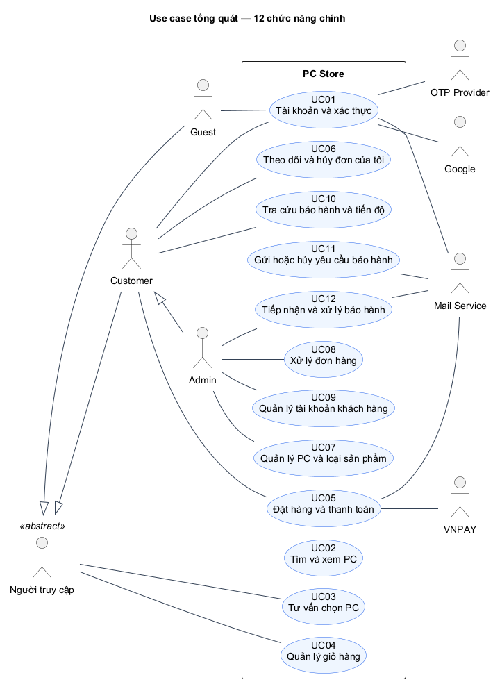

[Nguồn sơ đồ UC-OVERVIEW](../architecture/diagrams/report-01/source/UC-OVERVIEW.puml)

Sơ đồ dùng association và generalization đúng vai trò; không ép include/extend để trang trí. Login là tiền điều kiện của thao tác bảo vệ. Scheduler hết hạn và database là bên trong hệ thống, không vẽ thành người dùng ngoài.

## 3. Bảng đặc tả chức năng và activity

Mỗi mục dẫn tới bảng đặc tả có tiền/hậu điều kiện, input, bước chính, nhánh thay thế, quy tắc, dữ liệu và tiêu chí nghiệm thu. Mã Bn/E-Bn được giữ giữa phần chữ và activity. Các thao tác nhỏ nằm trong bảng luồng con để báo cáo gọn và dễ bảo vệ.

### UC01 — Tài khoản và xác thực

**Mục tiêu:** Tạo và sử dụng tài khoản để mua hàng; quản lý thông tin liên hệ của chính mình.

| Tác nhân | Tiền điều kiện | Kết quả |
|---|---|---|
| Guest, Customer | Các chức năng công khai không cần login. Sửa hồ sơ/liên kết cần phiên ACTIVE; thay liên hệ cần xác thực lại. | Đúng tài khoản được xác thực/cập nhật; lỗi không cấp quyền. Không lộ mật khẩu/OTP/token. |

[Bảng đặc tả đầy đủ UC01](../requirements/FUNCTIONAL_SPECIFICATION.md#uc01)

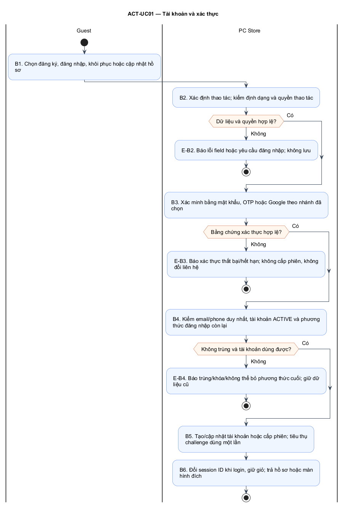

[Nguồn sơ đồ ACT-UC01](../architecture/diagrams/report-01/source/ACT-UC01.puml)

**Điểm cần giải thích:** Email/password tạo Customer; phone đăng ký chỉ tạo sau OTP đúng; Google mới tạo identity theo issuer+subject.

### UC02 — Tìm và xem PC

**Mục tiêu:** Tìm một PC đang bán và đọc cấu hình, giá, bảo hành trước khi lựa chọn.

| Tác nhân | Tiền điều kiện | Kết quả |
|---|---|---|
| Guest, Customer | Không cần đăng nhập. Chỉ PC ACTIVE được công bố. | Hiển thị thông tin hiện tại; chưa giữ hàng và chưa phát sinh đơn. |

[Bảng đặc tả đầy đủ UC02](../requirements/FUNCTIONAL_SPECIFICATION.md#uc02)

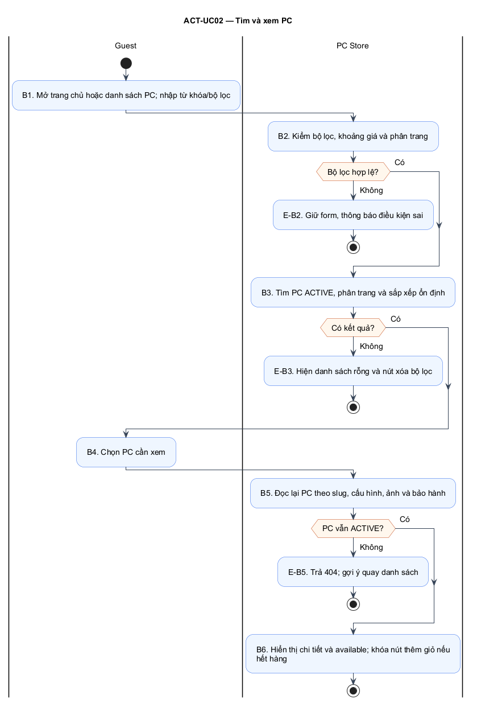

[Nguồn sơ đồ ACT-UC02](../architecture/diagrams/report-01/source/ACT-UC02.puml)

**Điểm cần giải thích:** Hiển thị tối đa 4 PC ACTIVE còn hàng; nếu không có vẫn giữ CTA catalog/tư vấn.

### UC03 — Tư vấn chọn PC

**Mục tiêu:** Nhận tối đa ba PC phù hợp nhu cầu và ngân sách, kèm lý do và hạn chế rõ ràng.

| Tác nhân | Tiền điều kiện | Kết quả |
|---|---|---|
| Guest, Customer | Không cần đăng nhập; Admin đã nhập dữ liệu phù hợp theo nhu cầu trong form PC. | Kết quả có thể giải thích; ngân sách chỉ tính giá PC, chưa phí giao; không reserve. |

[Bảng đặc tả đầy đủ UC03](../requirements/FUNCTIONAL_SPECIFICATION.md#uc03)

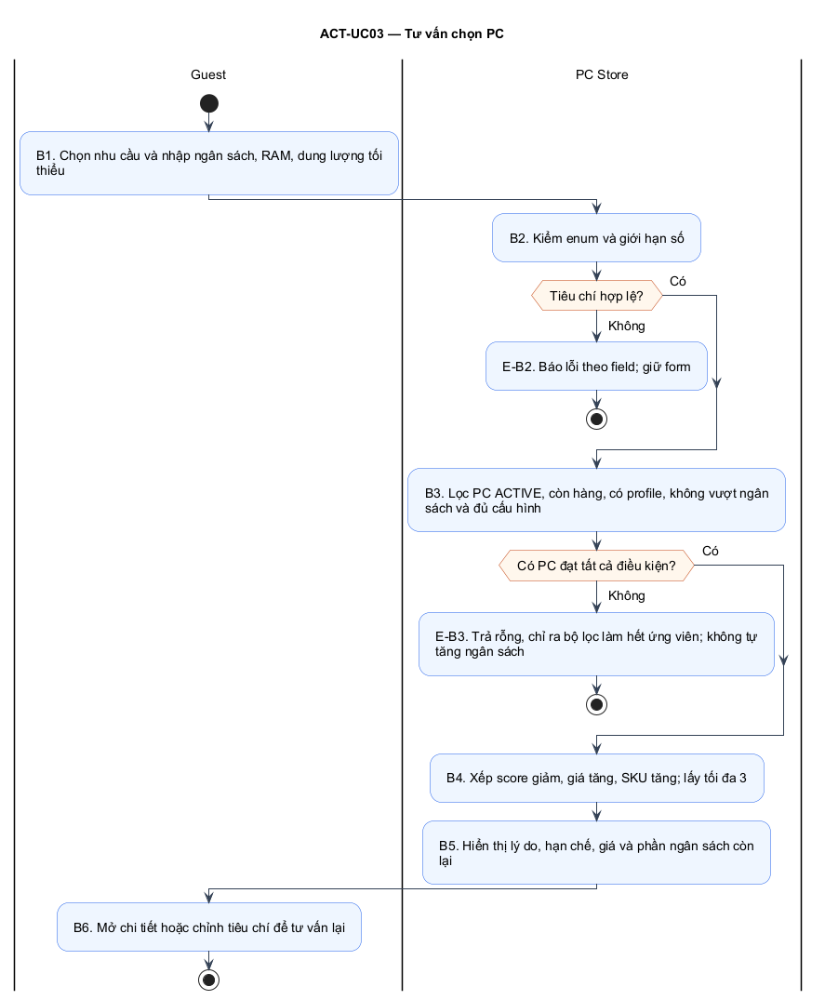

[Nguồn sơ đồ ACT-UC03](../architecture/diagrams/report-01/source/ACT-UC03.puml)

**Điểm cần giải thích:** Cho chỉnh tiêu chí và quay bước 1; không đề xuất PC vượt trần như thể đã đạt yêu cầu.

### UC04 — Quản lý giỏ hàng

**Mục tiêu:** Tập hợp PC và số lượng trước khi checkout bằng giỏ HTTP Session.

| Tác nhân | Tiền điều kiện | Kết quả |
|---|---|---|
| Guest, Customer | Có session; không yêu cầu đăng nhập. Giỏ tối đa 20 SKU. | Giỏ session cập nhật, không có cart table và không giữ tồn. |

[Bảng đặc tả đầy đủ UC04](../requirements/FUNCTIONAL_SPECIFICATION.md#uc04)

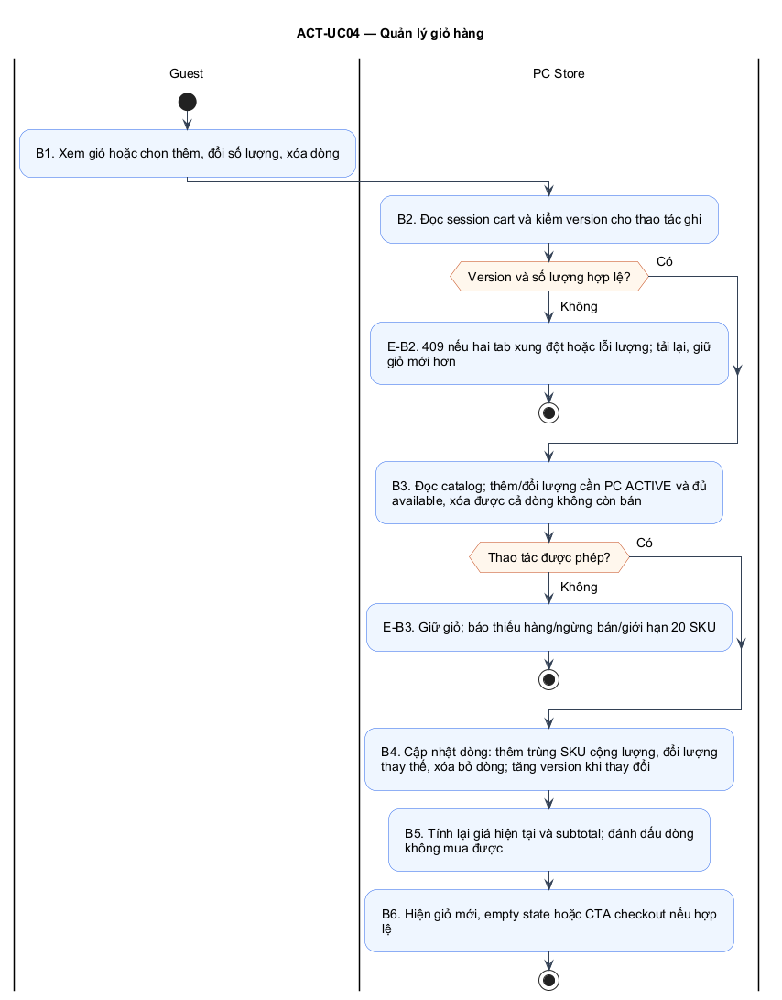

[Nguồn sơ đồ ACT-UC04](../architecture/diagrams/report-01/source/ACT-UC04.puml)

**Điểm cần giải thích:** Không mutate version; đọc lại giá và stock. Dòng PC đã xóa vẫn có cảnh báo và nút bỏ.

### UC05 — Đặt hàng và thanh toán

**Mục tiêu:** Tạo một đơn từ giỏ và chọn COD hoặc VNPAY sandbox, không bán vượt tồn hoặc nhân đôi đơn.

| Tác nhân | Tiền điều kiện | Kết quả |
|---|---|---|
| Customer | User ACTIVE đã đăng nhập, có phone verified; giỏ hợp lệ; địa chỉ đủ thông tin. | Đơn và tồn nhất quán; thanh toán online chỉ xác nhận qua IPN hợp lệ. Không có hoàn tiền/đối soát trong scope. |

[Bảng đặc tả đầy đủ UC05](../requirements/FUNCTIONAL_SPECIFICATION.md#uc05)

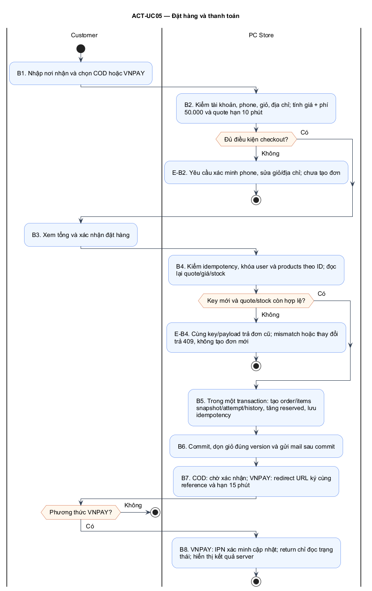

[Nguồn sơ đồ ACT-UC05](../architecture/diagrams/report-01/source/ACT-UC05.puml)

**Điểm cần giải thích:** Khóa SKU theo ID; không đủ lượng rollback toàn bộ, yêu cầu preview lại. Một key không tạo hai đơn.

### UC06 — Theo dõi và hủy đơn của tôi

**Mục tiêu:** Xem đơn đã đặt, tiến trình xử lý và tự hủy khi còn cho phép.

| Tác nhân | Tiền điều kiện | Kết quả |
|---|---|---|
| Customer | User ACTIVE; mọi truy vấn giới hạn theo principal. | Đọc đúng đơn; nếu hủy thành công giải phóng tồn đúng một lần; lịch sử không bị xóa. |

[Bảng đặc tả đầy đủ UC06](../requirements/FUNCTIONAL_SPECIFICATION.md#uc06)

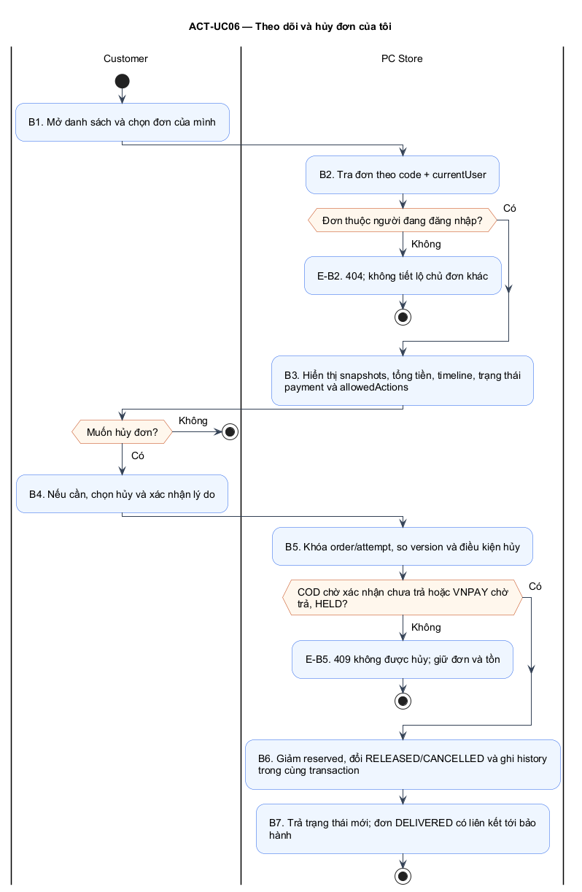

[Nguồn sơ đồ ACT-UC06](../architecture/diagrams/report-01/source/ACT-UC06.puml)

**Điểm cần giải thích:** Kết thúc sau hiển thị chi tiết, không bắt buộc chọn hủy.

### UC07 — Quản lý PC và loại sản phẩm

**Mục tiêu:** Duy trì PC, cấu hình, ảnh, giá, dữ liệu tư vấn, loại PC và tồn đơn giản.

| Tác nhân | Tiền điều kiện | Kết quả |
|---|---|---|
| Admin | Admin ACTIVE. PC là cấu hình hoàn chỉnh; không có phân hệ linh kiện/đa kho. | Catalog cập nhật; snapshots đơn cũ không đổi, tồn có thể giải thích; không tạo ledger doanh nghiệp. |

[Bảng đặc tả đầy đủ UC07](../requirements/FUNCTIONAL_SPECIFICATION.md#uc07)

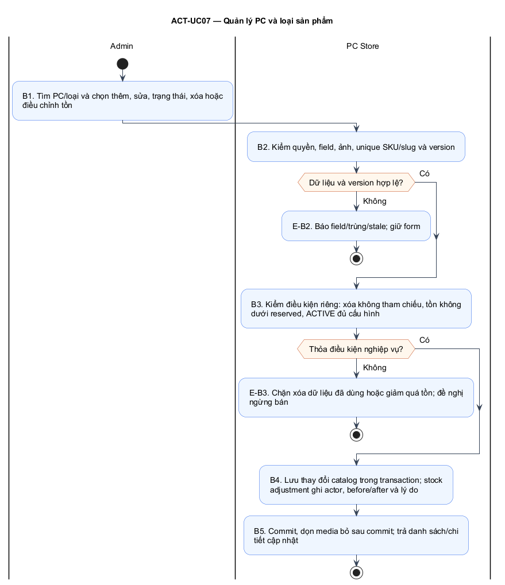

[Nguồn sơ đồ ACT-UC07](../architecture/diagrams/report-01/source/ACT-UC07.puml)

**Điểm cần giải thích:** Tạo SKU mới cho cấu hình lớn; SKU sau tạo bất biến. Edit không được ghi stock/reserved bằng field thường.

### UC08 — Xử lý đơn hàng

**Mục tiêu:** Xác nhận đơn, sửa lượng COD được phép, cập nhật giao hàng và xem ngoại lệ thanh toán.

| Tác nhân | Tiền điều kiện | Kết quả |
|---|---|---|
| Admin | Admin ACTIVE; order tồn tại; chỉ action hợp lệ được hiển thị. | Chỉ chuyển trạng thái hợp lệ; lịch sử actor/thời gian/lý do được giữ; không phát sinh quản trị logistics. |

[Bảng đặc tả đầy đủ UC08](../requirements/FUNCTIONAL_SPECIFICATION.md#uc08)

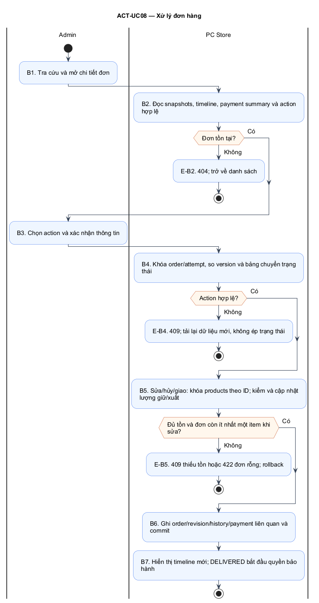

[Nguồn sơ đồ ACT-UC08](../architecture/diagrams/report-01/source/ACT-UC08.puml)

**Điểm cần giải thích:** Chỉ COD PENDING, AWAITING_CONFIRMATION. Giữ đơn giá/phí snapshot; không thêm SKU; lượng0 bỏ dòng, phải còn dòng dương; cập nhật cả payment amount.

### UC09 — Quản lý tài khoản khách hàng

**Mục tiêu:** Tra cứu, cập nhật thông tin cần thiết, khóa/mở hoặc xóa tài khoản đủ điều kiện.

| Tác nhân | Tiền điều kiện | Kết quả |
|---|---|---|
| Admin | Admin ACTIVE; không có UI cấp role hoặc xem credential. | Tài khoản được quản lý đúng điều kiện; đơn/snapshot không bị sửa theo profile. |

[Bảng đặc tả đầy đủ UC09](../requirements/FUNCTIONAL_SPECIFICATION.md#uc09)

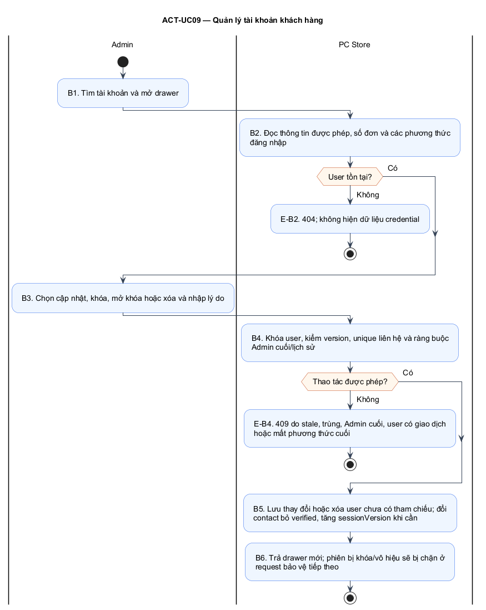

[Nguồn sơ đồ ACT-UC09](../architecture/diagrams/report-01/source/ACT-UC09.puml)

**Điểm cần giải thích:** Không xóa user có đơn hoặc được tham chiếu làm actor lịch sử; đề nghị khóa.

### UC10 — Tra cứu bảo hành và tiến độ

**Mục tiêu:** Biết mặt hàng đã mua còn bảo hành không và xem tình trạng yêu cầu đã gửi.

| Tác nhân | Tiền điều kiện | Kết quả |
|---|---|---|
| Customer | Đăng nhập ACTIVE; chỉ dữ liệu của chính Customer. | Khách thấy quyền lợi và tiến độ của mình; không có hồ sơ serial hay cam kết ngoài snapshot. |

[Bảng đặc tả đầy đủ UC10](../requirements/FUNCTIONAL_SPECIFICATION.md#uc10)

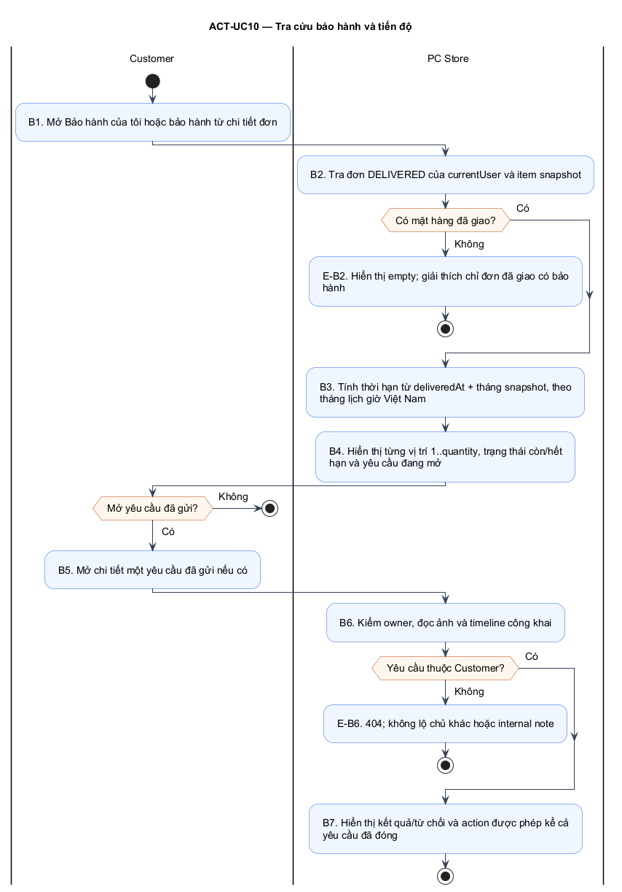

[Nguồn sơ đồ ACT-UC10](../architecture/diagrams/report-01/source/ACT-UC10.puml)

**Điểm cần giải thích:** now≥end hoặc warrantyMonths=0 không tạo yêu cầu mới; vẫn xem lịch sử.

### UC11 — Gửi hoặc hủy yêu cầu bảo hành

**Mục tiêu:** Đề nghị hỗ trợ cho một đơn vị PC đã mua, hoặc hủy khi cửa hàng chưa tiếp nhận.

| Tác nhân | Tiền điều kiện | Kết quả |
|---|---|---|
| Customer | Đăng nhập; item thuộc đơn DELIVERED của mình; tạo mới còn hạn và không có yêu cầu mở cùng item/unit. | Một yêu cầu mở/item/unit; không đổi tồn, không tạo shipment/refund/replacement. |

[Bảng đặc tả đầy đủ UC11](../requirements/FUNCTIONAL_SPECIFICATION.md#uc11)

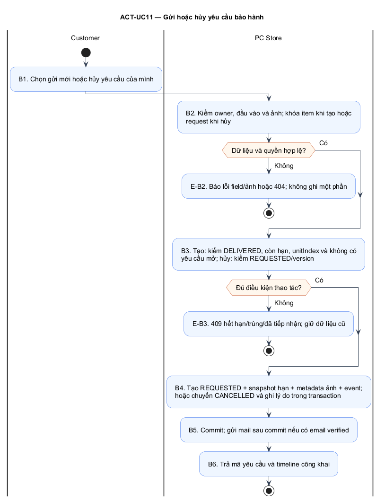

[Nguồn sơ đồ ACT-UC11](../architecture/diagrams/report-01/source/ACT-UC11.puml)

**Điểm cần giải thích:** Cùng clientRequestId/cùng payload trả yêu cầu cũ; khác payload trả409. Khóa item và unique active request chặn race.

### UC12 — Tiếp nhận và xử lý bảo hành

**Mục tiêu:** Cập nhật tiến độ và kết quả bảo hành để khách theo dõi được.

| Tác nhân | Tiền điều kiện | Kết quả |
|---|---|---|
| Admin | Admin ACTIVE; request tồn tại. Tiếp nhận máy trực tiếp và trao đổi ngoài hệ thống. | Khách thấy tiến độ/kết luận rõ ràng; lịch sử được giữ và ghi chú nội bộ không bị lộ. |

[Bảng đặc tả đầy đủ UC12](../requirements/FUNCTIONAL_SPECIFICATION.md#uc12)

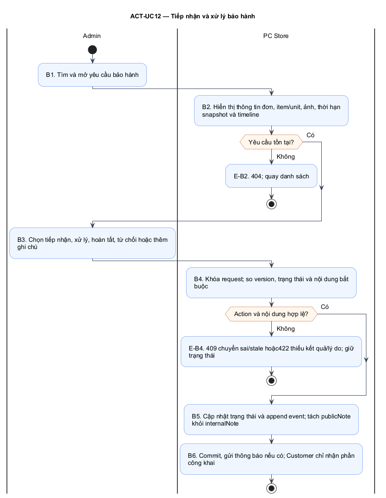

[Nguồn sơ đồ ACT-UC12](../architecture/diagrams/report-01/source/ACT-UC12.puml)

**Điểm cần giải thích:** REQUESTED→RECEIVED→PROCESSING→COMPLETED. Từ chối từ RECEIVED/PROCESSING→REJECTED, cần lý do công khai.

## 4. Thiết kế cơ sở dữ liệu

20 bảng phục vụ identity, catalog, sales, payment và aftersales. Cart và quote nằm trong session; advisory đọc catalog/profile, không cần bảng mới. Bảng order_items lưu snapshot để lịch sử mua hàng và bảo hành không thay đổi theo catalog.

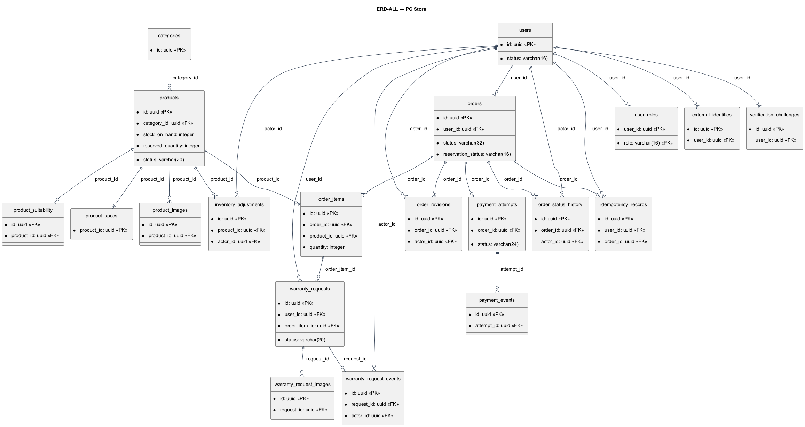

[Nguồn sơ đồ ERD-ALL](../architecture/diagrams/report-01/source/ERD-ALL.puml)

[ERD chi tiết và từ điển đầy đủ 20 bảng](../data/DATABASE_DESIGN.md). Khóa ngoại không cascade xóa lịch sử; validation nghiệp vụ tại Java. Giữ tồn được biểu diễn bằng marker trên orders và reserved_quantity ở products, không có bảng reservation riêng.

## 5. Các quyết định nghiệp vụ cần bảo vệ

- Giá và phí do server tính; quote10 phút không giữ hàng. Chỉ commit đặt đơn mới tăng reserved.
- Đơn COD chờ xác nhận mới được sửa lượng/hủy; giữ đơn giá snapshot. SHIPPING giảm onHand/reserved đúng một lần; DELIVERED ghi COD PAID.
- VNPAY có một attempt/order, hạn15 phút. Return không quyết định PAID; IPN hợp lệ mới cập nhật. Tiền đến muộn được đánh dấu REVIEW_REQUIRED, không hồi sinh đơn.
- Bảo hành bắt đầu lúc giao thành công, cộng tháng lịch từ snapshot; yêu cầu gửi hợp lệ được tiếp tục xử lý sau hết hạn. Không hai request mở cho cùng item/unit.
- Chủ đơn/yêu cầu mới xem dữ liệu riêng; Admin note không xuất hiện trong DTO Customer.

## 6. Phân công, kiểm chứng và nguồn

| Thành viên | Nội dung báo cáo/thiết kế phụ trách theo PLAN |
|---|---|
| Võ Văn Cảnh | UC05, transaction đặt hàng, thanh toán |
| Bùi Ngọc Bửu | UC02/UC07, catalog và số dư tồn, ERD |
| Huỳnh Đoàn Nhân | UC03/UC04, tư vấn và giỏ, nối UI |
| Võ Văn Nhựt | UC01/UC09, xác thực và phân quyền |
| Lê Thị Kim Ngân | UC06/UC08/UC10–UC12, đơn và bảo hành, truy vết/báo cáo |

Đây là phân công theo kế hoạch, không phải tuyên bố ai đã hoàn thành code. [Ma trận truy vết](../requirements/TRACEABILITY_MATRIX.md) bao phủ24 màn hình; [kết quả kiểm tra artifact](REPORT_01_VALIDATION.md) ghi những kiểm tra đã chạy, tách khỏi nghiệm thu ứng dụng dự kiến.

Nguồn đầu vào: phiếu đăng ký `23676641_DangkyDetai.pdf`, tài liệu môn `Phieu DK _BaiTap_Nhom_LapTrinhWWWJava_1 (1).docx`, PLAN/UI phiên bản hiện hành. Giao thức thanh toán đối chiếu [VNPAY](https://sandbox.vnpayment.vn/apis/docs/thanh-toan-pay/pay.html); ký pháp theo [OMG UML](https://www.omg.org/spec/UML/2.5.1/); công cụ dựng nguồn sơ đồ [PlantUML](https://plantuml.com/).

Giới hạn đồ án: số máy theo vị trí không thay thế serial; tiếp nhận bảo hành/giao hàng được Admin xác nhận thủ công. Chưa có dữ liệu khảo sát cửa hàng hoặc kiểm thử ứng dụng, do đó không ghi nhận số liệu hiệu năng/doanh thu hay kết quả triển khai giả.
